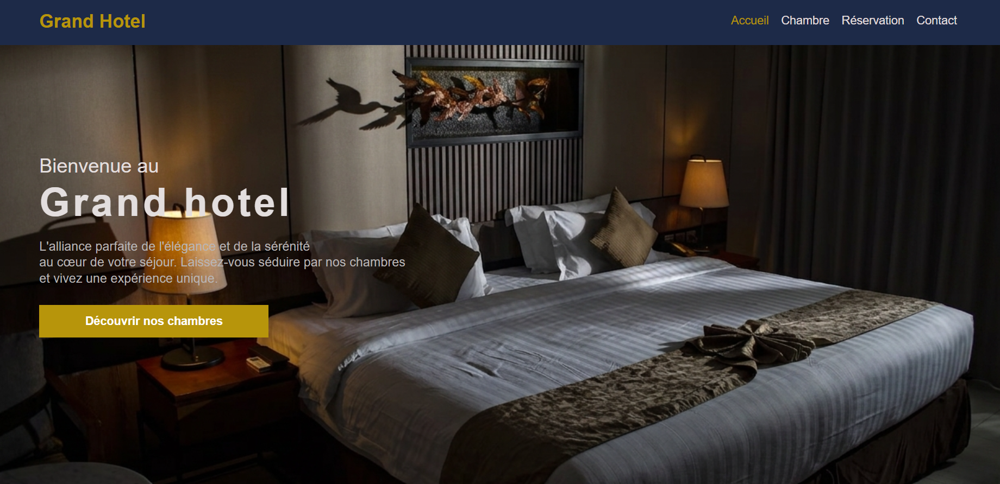

# 🏨 Site Hôtel

## Desciption
Un site web vitrine responsive pour la réservation et la présentation des chambres d'hôtel. (réalisé en L1)



## 🚀 Technologies utilisées
* HTML5
* CSS3 (Flexbox & Grid)

## 📁 Structure du projet
```text
Site-Hotel/
├── assets/
│   ├── css/
│   │   └── style.css
│   │
│   └── images/
├── index.html
└── README.md